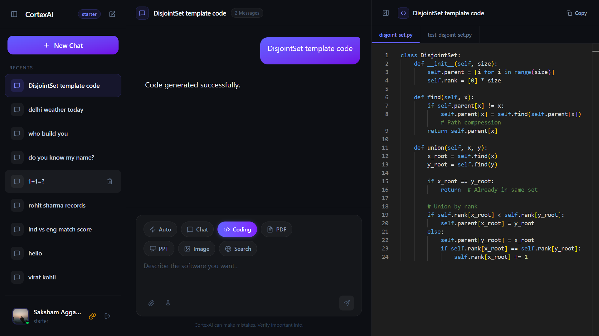
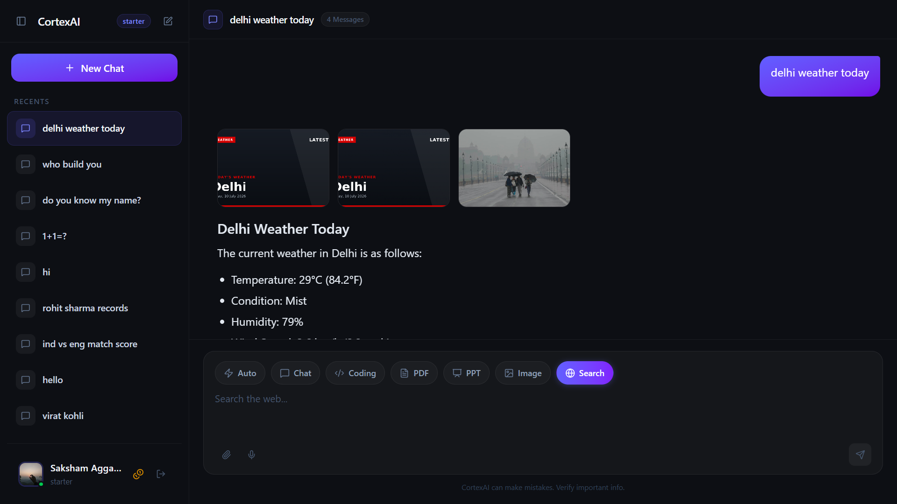
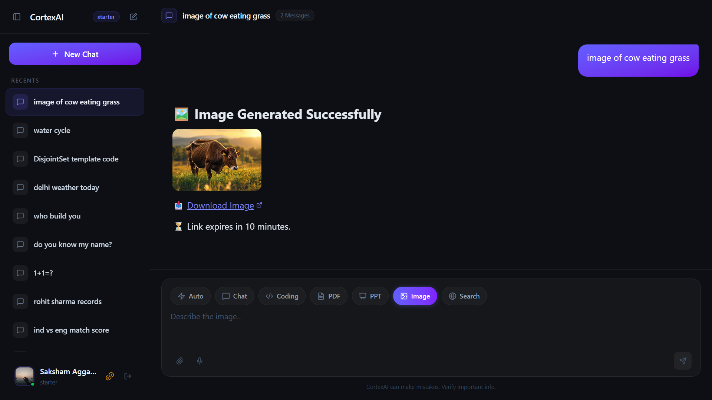
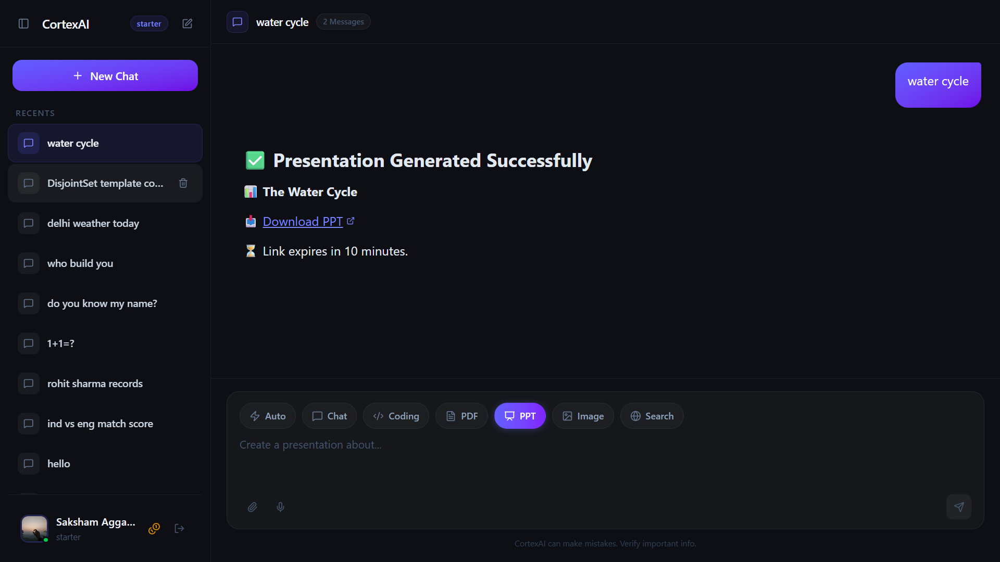
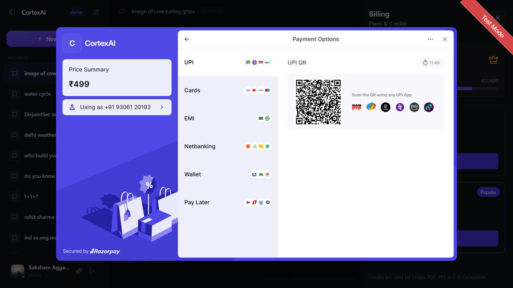

# CortexAI

CortexAI is a premium, state-of-the-art multi-agent AI platform built using a Node.js microservice architecture on the backend, and a modern React + Tailwind CSS single page application on the frontend. The platform orchestrates complex AI behaviors (such as automated routing, codebase generation, Tavily web searching, file parsing, and PPT/PDF compilation) powered by LangChain and LangGraph.

---

## 🚀 Key Features

- **Microservice Architecture**: Fully decoupled services for Authentication, Chat, Agents, and Billing coordinated by a secure API Gateway.
- **LangGraph Supervisor Routing**: Uses a supervisor router to direct user queries to specialized sub-agents based on context or file attachments.
- **Monaco Code Editor integration**: Features live side-by-side editing, syntax highlighting, and an iframe preview panel for generated code files.
- **Multi-Agent Ecosystem**:
  - **Auto Agent**: Dynamically evaluates the request/attachment type to route to the correct agent.
  - **Chat Agent**: Normal chatbot conversation with message memory cached in Redis.
  - **Coding Agent**: Generates production-ready react/html components with live preview.
  - **PDF Agent**: Compiles professionally styled PDF documents using PDFKit and uploads them to AWS S3.
  - **PPT Agent**: Instantly generates downloadable PowerPoint presentations using PPTXGenJS.
  - **Image Agent**: Produces creative, high-fidelity images via Pollinations AI.
  - **Web Search Agent**: Searches the live web using Tavily Search API.
- **Razorpay Billing & Credits**: Multi-tier credit systems (Free, Starter, Pro plans) with usage cost deductions.

---

## 🛠️ Technology Stack

| Layer                | Technologies                                                                               |
| :------------------- | :----------------------------------------------------------------------------------------- |
| **Frontend**         | React 19, Vite, Tailwind CSS v4, Redux Toolkit, Framer Motion, Monaco Editor, Lucide Icons |
| **Gateway**          | Express, Helmet, Morgan, Cookie Parser, `express-http-proxy`                               |
| **Microservices**    | Node.js, Express, Firebase Admin Core (Auth), Razorpay API (Billing)                       |
| **Databases**        | MongoDB (Mongoose), Redis (Session Cache, Conversation Memory, Rate Limiter)               |
| **Vector DB**        | Qdrant (for RAG / PDF parsing)                                                             |
| **AI Orchestration** | LangChain, LangGraph                                                                       |
| **Providers**        | Groq (Llama 3.3), Google Generative AI (Gemini 2.5), OpenRouter (DeepSeek), Tavily         |
| **Storage**          | AWS S3 (for generated file hosting)                                                        |

---

## 📐 Architecture

CortexAI is designed as a decoupled, scalable microservices application.

### Layer Breakdown

1.  **Frontend Layer**: A React 19 single page application styled with Tailwind CSS, utilizing Redux Toolkit for unified chat and user state.
2.  **API Gateway**: A single entrance node that manages security/headers, parses user sessions from Redis, and proxies path requests (e.g. `/api/chat/*`) to downstream internal microservices.
3.  **Microservices Layer**:
    - **Auth Service**: Connects to Firebase Admin and handles database user creations.
    - **Chat Service**: Manages conversation history records and raw message saves.
    - **Agent Service**: Orchestrates the LangGraph execution flow, using Redis for rate-limiting and conversation memory, Qdrant for document RAG, S3 for storing compiled artifacts, and LLMs for generation.
    - **Billing Service**: Triggers Razorpay order creations and handles payment verification webhooks.
4.  **Data & Third-Party Layer**: Local data layers (MongoDB, Redis Cache) and external APIs (Firebase, Razorpay, Qdrant, AWS S3, Tavily, and LLM APIs).

---

## 📸 Platform Showcases

### Coding Agent with live Artifact Preview

Features full-page sandbox editing and instant render.


### Web Search Agent (Tavily Integration)

Fetches live weather, real-time data, and timely responses.


### Creative Image Generation Agent

Generates beautiful artwork and saves files directly to cloud storage.


### PPT Generation Agent

Dynamically designs downloadable `.pptx` slides based on custom slide prompts.


### Razorpay Billing Drawer

Upgrades user subscription plans and increments usage credits.


---

## ⚙️ Setup and Installation

### Prerequisites

- Node.js (v18+)
- MongoDB Instance
- Redis server
- AWS S3 Bucket
- API keys for Firebase, Groq, Gemini, OpenRouter, Tavily, and Razorpay

### 1. Repository Setup & Dependencies Installation

First, install the package dependencies for the root and all microservices using the installer script in the `backend` folder:

```bash
# Navigate to the backend folder
cd backend

# Install dependencies for gateway and all services (auth, chat, agent, billing)
npm run build
```

Then, install frontend dependencies:

```bash
cd ../frontend
npm install
```

### 2. Configure Environment Variables

Create a `.env` file in each respective directory based on the following configurations:

#### Backend Services `.env` Templates:

##### `backend/gateway/.env`

```env
PORT=8000
FRONTEND_URL=http://localhost:5173
AUTH_SERVICE=http://localhost:8001
CHAT_SERVICE=http://localhost:8002
AGENT_SERVICE=http://localhost:8003
BILLING_SERVICE=http://localhost:8004
REDIS_URL=redis://localhost:6379
```

##### `backend/services/auth/.env`

```env
PORT=8001
MONGODB_URL=your_mongodb_connection_string
REDIS_URL=redis://localhost:6379
FIREBASE_SERVICE_ACCOUNT=your_firebase_service_account_json_string
```

##### `backend/services/chat/.env`

```env
PORT=8002
MONGODB_URL=your_mongodb_connection_string
```

##### `backend/services/agent/.env`

```env
PORT=8003
MONGODB_URL=your_mongodb_connection_string
GOOGLE_API_KEY=your_gemini_key
GROQ_API_KEY=your_groq_key
TAVILY_API_KEY=your_tavily_key
OPENROUTER_API_KEY=your_openrouter_key
AWS_ACCESS_KEY_ID=your_aws_key
AWS_SECRET_ACCESS_KEY=your_aws_secret
AWS_REGION=your_aws_region
AWS_BUCKET_NAME=your_s3_bucket
QDRANT_URL=your_qdrant_db_url
QDRANT_API_KEY=your_qdrant_api_key
CHAT_SERVICE=http://localhost:8002
AUTH_SERVICE=http://localhost:8001
```

##### `backend/services/billing/.env`

```env
PORT=8004
MONGODB_URL=your_mongodb_connection_string
RAZORPAY_KEY_ID=your_razorpay_key
RAZORPAY_KEY_SECRET=your_razorpay_secret
AUTH_SERVICE=http://localhost:8001
```

#### Frontend `.env` Templates:

##### `frontend/.env`

```env
VITE_SERVER_URL=http://localhost:8000
VITE_RAZORPAY_KEY=your_razorpay_key
```

### 3. Launching Locally

#### Start the Backend Services

To launch the API gateway and all backend microservices concurrently, execute:

```bash
cd backend
npm start
```

#### Start the Frontend Client

To launch the React dashboard application, execute:

```bash
cd frontend
npm run dev
```

The application will run on `http://localhost:5173` and communicate through the Gateway running on `http://localhost:8000`.
